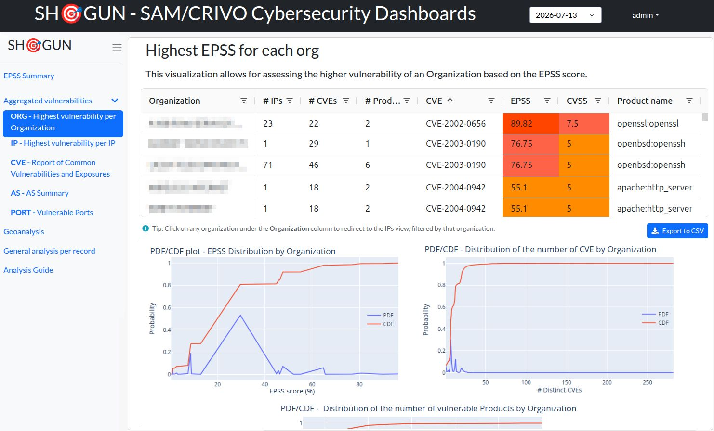
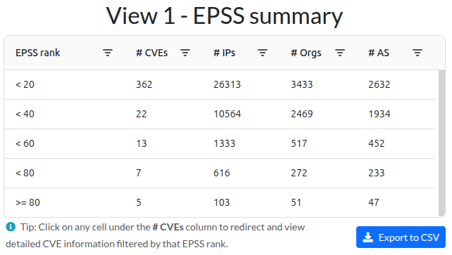
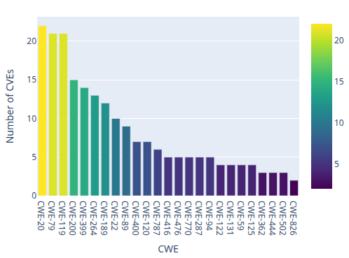
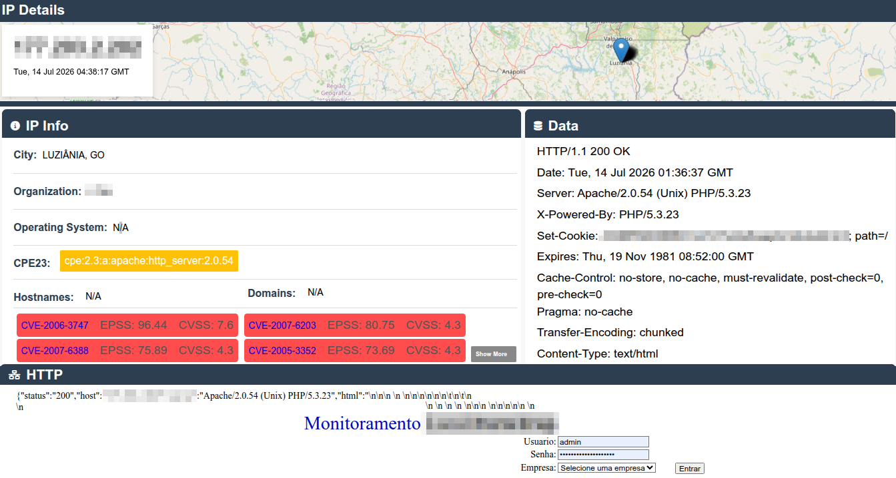

# SHOGUN: An Integrated Dashboard for Vulnerability Analysis via Internet-Wide Search Engines

SHOGUN is an interactive dashboard for the multidimensional, longitudinal analysis of internet-wide vulnerability data. It ingests daily dumps from search engines such as Shodan, enriches them with external vulnerability-intelligence sources (NIST/NVD, FIRST EPSS, CISA KEV), and exposes eight analytical views, from macro-level views (organizations, Autonomous Systems, ports) down to per-asset forensic detail, through a reactive Dash/Flask web interface, with cross-view drill-down navigation between them. The architecture is split into Front-end/Back-end/Data-Store: a PySpark pipeline (built on the [TLHOP-Library](https://github.com/lucasmsp/tlhop-library)) periodically transforms raw JSON dumps into versioned, compressed Delta Lake tables, which are served to the web interface, backed by PostgreSQL for user/authentication data.


## Readme Structure

This document is organized as follows:

- **[Badges Claimed](#badges-claimed)** — the reproducibility badges claimed by the authors for this artifact;
- **[Basic Information](#basic-information)** — hardware/software requirements and repository layout;
- **[Dependencies](#dependencies)** — external services, datasets, and libraries required to run the tool;
- **[Security Concerns](#security-concerns)** — risks reviewers should be aware of before executing the artifact, and how to mitigate them;
- **[Installation](#installation)** — how to obtain and build the application;
- **[Minimal Test](#minimal-test)** — a short smoke test to confirm the environment is correctly installed;
- **[Experiments](#experiments)** — step-by-step instructions to explore the dashboard's analytical views and interaction model;
- **[LICENSE](#license)**.

## Badges Claimed

We are claiming the **Available Artifacts**, **Sustainable Artifacts**, and **Functional Artifacts** badges.

We are not claiming Reproducible Experiments. The evaluation in Section 4 of the paper was performed over real Shodan data for the Brazilian IPv4 space, which was made available to us by CERT.br. SHOGUN itself, however, is a visualization and analysis layer built on top of Shodan data, it doesn't ship with any pre-collected dataset, so to test the tool end to end (and reproduce the exact numbers from Section 4), reviewers need to obtain their own daily Shodan dump on their own, through a Shodan account/API. Since we can't guarantee everyone has that kind of access, the Experiments section below focuses on what any reviewer can check directly: the eight analytical views, the drill-down navigation between them, and the overall interactivity of the dashboard.

## Basic Information

### Hardware requirements

- A Linux host with Docker support (the tool was evaluated on Debian 12).
- **CPU:** at least 2 cores for the minimal test (interface only, no processing). To reproduce the performance figures from the paper (Section 4), a machine with several cores is recommended; the original evaluation constrained Spark to **10 cores**, on a 48-core Intel Xeon Gold 5318N with 503 GiB of RAM.
- **RAM:** at least 4 GB for the dashboard/PostgreSQL services alone. The data-processing (`scheduler`) service additionally requires the amount configured in `SPARK_MEMORY` (default `4g` in `docker-compose.yml`; the paper's evaluation used 20 GiB).
- **Disk:** at least 5 GB free for the Docker images and dependencies.
- **Network access** is required during the Docker build (to clone `tlhop-library` from GitHub and download Spark/Delta Lake JARs from Maven Central) and at runtime (to download the NIST/NVD, EPSS, and CISA KEV feeds).

### Software requirements

- Docker Engine and Docker Compose (v2 syntax, `docker compose ...`).
- Git (to clone the repository).
- No local Python/Spark installation is required when using Docker; if running outside containers (developer mode), Python 3.10+ and the TLHOP-Library available on `PYTHONPATH` are required (see [Dependencies](#dependencies)).

### Repository structure

```
shogun-dashboard/
├── Dockerfile                 # Builds the Spark + TLHOP-Library + dashboard image
├── docker-compose.yml         # Orchestrates the dashboard, scheduler, and postgres services
├── start-dev.sh               # Runs the dashboard locally (developer mode)
├── start-dev-wgsi.sh          # Runs the dashboard locally via WSGI/gunicorn
├── local/
│   └── env                    # Local secrets used by docker-compose (POSTGRES_PASSWORD, etc.)
├── output_data/
│   └── tlhop_datasets/
│       └── auxiliar/          # Auxiliary datasets downloaded by TLHOP-Library (NVD, EPSS, CISA KEV)
└── dashboard/                 # Main application source code
    ├── app.py                 # Entry point (dev server)
    ├── wsgi.py                 # Entry point for WSGI/gunicorn deployment
    ├── requirements.txt        # Python dependencies of the dashboard service
    ├── assets/                 # Static front-end assets (CSS, JS, GeoJSON of Brazilian states)
    ├── templates/               # Flask (non-Dash) HTML templates: login, admin, profile, IP details
    └── project/                 # Application package
        ├── dash_server.py       # Dash/Flask app bootstrap
        ├── flask_routes.py      # Auth routes, admin panel, voting API, IP-detail API
        ├── models.py            # SQLAlchemy models (User, Vote)
        ├── auth.py               # Dash callbacks for login/logout/navigation
        ├── layout.py             # Sidebar and page layout registration
        ├── callbacks.py          # Registers all view-specific Dash callbacks
        ├── storage.py            # DatasetManager: reads/manages Delta Lake tables
        ├── scheduler.py          # Watches SHODAN_FOLDER and triggers processing
        ├── computation.py        # Launches the PySpark job (TLHOP-Library) per dump
        ├── guide.py               # "Analysis Guide" panel content
        ├── auxiliar.py            # Shared UI helpers (color scales, grid layout, etc.)
        ├── general.py             # Shared/global Dash callbacks
        ├── filters.py             # Shared filter-modal components
        └── query1_summary.py … query7_ports.py   # One module per dashboard panel (see table below)
```

The eight analytical views described in the paper map to the code as follows:

| # | View (paper) | Delta table | Module |
|---|---|---|---|
| 1 | EPSS Summary | Summary | `query1_summary.py` |
| 2 | ORG — Highest vulnerability per Organization | Orgs | `query2_orgs.py` |
| 3 | IP — Highest vulnerability per IP | IPs | `query2_ips.py` |
| 4 | CVE — Report of Common Vulnerabilities and Exposures | CVEs | `query3_cve.py` |
| 5 | AS Summary | ASes | `query6_as.py` |
| 6 | Vulnerable Ports Summary | Port | `query7_ports.py` |
| 7 | Geoanalysis | — | `query4_geo.py` |
| 8 | General Analysis per Record | General Records | `query5_report.py` |

## Dependencies

### Input data

SHOGUN doesn't come bundled with any dataset, it's a processing and visualization layer on top of Shodan. To exercise the full pipeline, you need your own **Shodan** daily dump for the region you want to monitor, in the format `BR.<YYYYMMDD>.json.bz2` (the `BR` prefix reflects the Brazilian IPv4 scope used in the paper's evaluation, but the pipeline itself isn't tied to any specific country). This is the file the `scheduler` service watches for and picks up automatically.

Getting a dump requires a Shodan account with API/export access; how to query and export data from Shodan is outside the scope of this artifact (see Shodan's own documentation). Without a dump, reviewers can still complete the [Minimal Test](#minimal-test) and explore every view in its empty state, the interface, authentication, and navigation are all fully functional without any input data, but the panels themselves will only populate once a real dump has been processed.

### External services/libraries fetched automatically

- **[TLHOP-Library](https://github.com/lucasmsp/tlhop-library)** — cloned via `git clone --depth 1` and installed during the Docker build. It provides the Spark-based filtering/enrichment pipeline (`ShodanVulnerabilitiesBanners`) and the crawlers that download:
  - **NIST/NVD** (National Vulnerability Database) — CVE/CVSS/CWE metadata;
  - **FIRST EPSS** (Exploit Prediction Scoring System) — daily exploitation-probability scores;
  - **CISA KEV** (Known Exploited Vulnerabilities catalog).
- **Apache Spark** `3.5.5` (base Docker image `spark:3.5.5-java17-python3`).
- **Delta Lake** `3.3.0` (`delta-spark` Python package + Maven JARs, versions pinned via the `DELTA_VERSION` build argument).
- **PostgreSQL** (`postgres:latest` in `docker-compose.yml`) — stores dashboard users and per-record votes (`User`, `Vote` models).
- Python dependencies of the dashboard service are listed in `dashboard/requirements.txt`.
### Configuration / environment variables

| Variable | Used by | Default | Description |
|---|---|---|---|
| `CRON_EXPRESSION` | scheduler | `*/1 * * * *` (paper default: `0 3 * * *`) | How often the scheduler checks for a new Shodan dump |
| `SPARK_UI_PORT` | scheduler | `4040` | Spark UI port (can be exposed to monitor processing) |
| `SPARK_VCORES` | scheduler | `6` (code default `8`) | vCPUs allocated to the Spark job |
| `SPARK_MEMORY` | scheduler | `4g` (code default `10g`) | RAM allocated to the Spark driver |
| `SHODAN_FOLDER` | scheduler, dashboard | `/opt/input_data/` | Directory monitored for new dumps |
| `RESULT_FOLDER` | scheduler, dashboard | `/opt/output_data/` | Directory where Delta tables are written/read |
| `TLHOP_DATASETS_PATH` | scheduler | *(unset by default in `docker-compose.yml`)* | Directory used by TLHOP-Library to cache NVD/EPSS/CISA data |
| `NUMBER_OF_DUMPS_TO_KEEP` | dashboard/scheduler | `7` | Rolling retention window (days) enforced via Delta `VACUUM` |
| `POSTGRES_URL`, `POSTGRES_USER`, `POSTGRES_DB`, `POSTGRES_PASSWORD` | dashboard, postgres | — | PostgreSQL connection settings |
| `FLASK_SECRET` | dashboard | placeholder in `docker-compose.yml` | Flask session-signing secret — **must** be replaced (see below) |
| `ADMIN_PASSWORD` | dashboard | `admin` | Password of the auto-created `admin` user on first boot |

## Security Concerns

Executing this artifact carries the following risks that reviewers should mitigate before running it:

- **Exposed ports.** By default, `docker-compose.yml` publishes the dashboard on host port **8080**, the Spark UI on **4040**, and PostgreSQL on **5432**. These will be reachable from any host that can reach the reviewer's machine unless a firewall/NAT restricts access. Reviewers running this on a shared or internet-facing machine should either bind these ports to `127.0.0.1` or block them at the firewall.
- **Default administrative credentials.** The dashboard automatically creates an `admin` user with password `admin` on first boot if `ADMIN_PASSWORD` is not set. **Always set `ADMIN_PASSWORD` to a strong value** before first startup, especially if the dashboard port is reachable from outside `localhost`.
- **Session secret.** `FLASK_SECRET` ships as a placeholder string (`XXXXXXXXXXXXXXXX`) in `docker-compose.yml`. This **must** be replaced with a random value (e.g., the output of `python3 -c "import os; print(os.urandom(24).hex())"`) before any non-local use; otherwise session cookies can be forged.
- **Database credentials.** `POSTGRES_PASSWORD` is provided via the `local/env` file (excluded from version control via `.gitignore`, and referenced by `env_file:` in `docker-compose.yml`). Reviewers must generate their own value and must not reuse any example value from the documentation.
- **Third-party data during build.** The Docker build clones `tlhop-library` directly from GitHub and downloads JARs from Maven Central at build time; this requires trusting those sources' current content, since no specific commit/tag or checksum is pinned.
- **Input data privacy.** If you provide your own Shodan dump to exercise the processing pipeline, keep in mind that Shodan banners can contain sensitive information (IP addresses, organization names, service banners). Treat any such file as sensitive and remove it from the evaluation machine after use.

## Installation

1. **Clone the repository:**

   ```bash
   git clone https://github.com/lucasmsp/shogun-dashboard.git
   cd shogun-dashboard


2. **(Optional) Configure secrets.** By default, `docker-compose.yml` still works without this step, but for anything beyond a quick local test, you should set your own PostgreSQL password instead of relying on whatever default the `postgres` image falls back to, and replace the placeholder session secret. Create `local/env` with a PostgreSQL password:

   ```bash
   mkdir -p local
   echo "POSTGRES_PASSWORD='$(python3 -c "import secrets; print(secrets.token_urlsafe(24))")'" > local/env
   ```

Then edit `docker-compose.yml` and replace the `FLASK_SECRET` placeholder with a freshly generated value. `ADMIN_PASSWORD` isn't listed there by default, so add a new line for it under the `dashboard` service's `environment:` block (e.g. `- ADMIN_PASSWORD=<your-strong-password>`). See [Security Concerns](#security-concerns) for why these matter.

3. **(Optional) Prepare input/output directories** so data persists across container restarts:

   ```bash
   mkdir -p input_data output_data
   ```

4. **Pull and start the services:**

   ```bash
   sudo docker compose pull
   sudo docker compose up
   ```
The first command fetches the pre-built image (`lucasmsp/tlhop-dashboard:latest`) referenced in `docker-compose.yml`, so you don't need to build it locally. The second one starts the three containers: `shogun_postgres`, `shogun_dashboard`, and `shogun_scheduler`. (`sudo` is only needed if your user isn't in the `docker` group; if you'd rather build the image yourself instead of pulling it, use `docker compose up --build`).

At the end of this process, the dashboard should be reachable at `http://localhost:8080`.

### Developer mode (without Docker for the dashboard)

For active development, only PostgreSQL needs to run in a container:

```bash
docker compose up postgres
bash start-dev.sh
```

## Minimal Test

This test verifies that the environment is correctly installed and that the web interface, authentication, and database are functional, **it does not require a real Shodan dump**.

1. Follow steps 1–4 of [Installation](#installation).
2. Wait until the logs show the `shogun_dashboard` and `shogun_postgres` containers as healthy/running (`docker compose ps`).
3. Open `http://localhost:8080` in a browser. You should be redirected to `/login`.
4. Log in with user `admin` and the password configured via `ADMIN_PASSWORD`.
5. You should be redirected to `/dashboard/summary`. Because no Shodan dump has been processed yet, the panels will show empty/zeroed tables and charts, this is expected and confirms that the Dash/Flask/PostgreSQL stack is working end to end.
6. Open the **Analysis Guide** entry in the sidebar and confirm that the eight-view description (mirroring the paper's Table 1) renders correctly, this exercises the static-content rendering path, independent of any data.
7. As `admin`, open `/admin` and confirm the user-management page loads (create/remove users, change passwords), this exercises the authentication/authorization routes described in [Security Concerns](#security-concerns).

Expected resources: this step uses well under 1 GB of RAM/disk beyond the Docker images themselves, and completes in a few minutes (dominated by the Docker build).

## Experiments

The full performance evaluation in Section 4 of the paper was run over 15 days of real Shodan data for the Brazilian IPv4 space, which isn't something we can package with this artifact, reproducing those exact numbers would require reviewers to pull an equivalent dump themselves from Shodan. So instead of asking for that, the experiments below walk through what actually defines SHOGUN as a tool: the eight analytical views and the drill-down navigation between them.

**Common prerequisite:** environment installed as described in [Installation](#installation), with the [Minimal Test](#minimal-test) completed successfully and the reviewer logged in as `admin`.

The screenshots below are taken from the paper's own case study, so you can compare the *structure* of what you see (titles, filters, columns, chart placeholders, clickable fields) against a populated example, even if the numbers won't match.

### Claim #1 — "The dashboard exposes eight complementary analytical views, from macro level down to individual-asset level"

**Objective:** confirm that the eight views described in Table 1 of the paper are implemented and reachable from the sidebar.

**Commands:** none, this is verified directly in the browser.

1. In the sidebar, navigate to each of the eight views: **EPSS Summary**, **ORG**, **IP**, **CVE**, **AS Summary**, **Vulnerable Ports**, **Geoanalysis**, and **General Records** (`/dashboard/<view>`).
2. For each view, check that the page loads without error, showing its title, its filter controls, its table columns, and the space reserved for charts (empty for now, since there's no processed data).
3. Open the **Analysis Guide** and compare each view's description with what you just saw in the interface.

For reference, here's the **ORG** view from the paper, populated with real (anonymized) data — this is what the table and the PDF/CDF charts look like once data has been processed:



**Verification:** all eight pages should load without server errors and show the same filter/table/chart structure as the Analysis Guide and the screenshot above, that's what confirms each panel's visualization layer is wired up correctly.

**Expected time/resources:** a few minutes; nothing beyond what the minimal test already used.

### Claim #2 — "Cross-view drill-down navigation (macro → micro)"

**Objective:** confirm the interactive navigation flow, from aggregate to individual-asset level, described in Section 5/Figures 5–7 of the paper.

**Commands:** none, this is exercised through the clickable table columns.

1. Open **EPSS Summary** (`/dashboard/summary`) and check that the **# CVEs** column is clickable.

   

2. From the CVE Report view, click on the # Orgs count for a given CVE, this takes you to the IP view ("Highest vulnerability per IP"), filtered to that CVE. Also check that the CVE Report itself includes the statistical charts described in the paper (e.g., CVE distribution by CWE):

   

3. From the **IP - Highest vulnerability per IP** view, click on one of the entries under the **IP** column to open **General Analysis per Record**. From there, click on one of the entries under the **IP** column to open **IP Details** (`/details/<meta_id>`), which shows geolocation, CPE identifiers, HTTP/banner data, and the criticality-voting section for that host:

   

**Verification**: each click should take you to the next view without needing to reconfigure filters manually, carrying the filtering context forward through EPSS Summary, CVE Report, IP, General Analysis per Record, and IP Details, that's the flow shown in the screenshots above. Tables will be empty on the reviewer's instance, but the navigation itself (clickable columns, /details/<meta_id> routes) should work regardless.

**Expected time/resources:** a few minutes; nothing computationally relevant.


---

Together, these three claims cover the structure, navigation, and interactivity of SHOGUN's visualizations, which is really the core contribution the paper is making on the interface side. The performance numbers from Section 4 aren't something we ask reviewers to reproduce here, since that would require access to a Shodan dump of comparable scale; those results are reported and discussed in the paper itself.

## LICENSE

This project is licensed under the [MIT License](LICENSE) — see the `LICENSE` file for details.